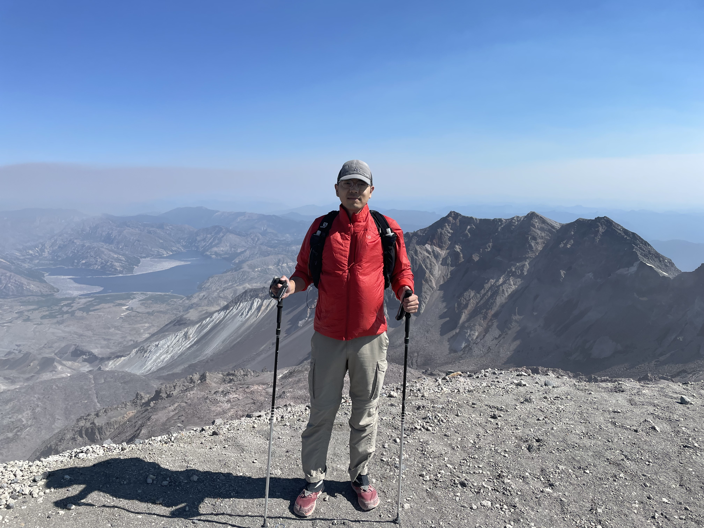
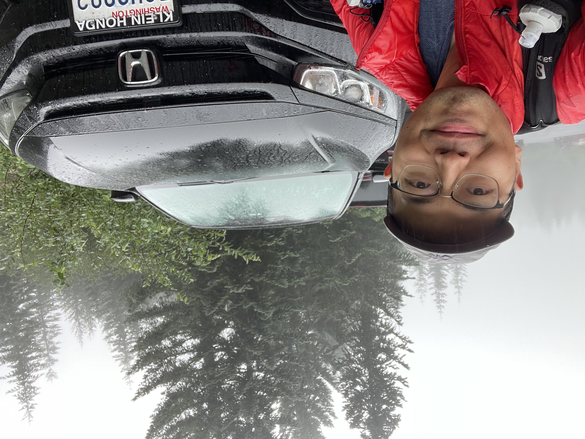

# Lost in St. Helens: 一次漫长而疯狂的生日之旅

从去年开始，我决心每年生日爬一次山。作为一个挑战，选择对象通常是极具标志性的，并且比我以往爬过都要更难的山。去年完成了mailbox，今年我瞄向了圣海伦火山。

圣海伦是一座靠近华盛顿和俄勒冈边界的活火山，其1980年的大爆发在山顶形成了一个巨大的马蹄形火山口。登山者可以沿着固定的线路来到火山口边缘，甚至再沿着边缘走到海拔2550米的最高点。整条线路往返10.7 mile (17 km)，爬升约4500 feet (1370 m)，平均需要7-12小时完成。出发前我在想，还有比爬这座山更酷的庆祝生日的办法吗？事实证明是有的，这次经历的疯狂程度远超我的想象，以至于我不得不将它记录下来。

## 登顶圣海伦

由于距离西雅图较远，我提前一天开到了trailhead，并在车里睡了一晚。车里睡的不算舒适，天还没亮我就醒了，但所有的困意都已被兴奋冲散。收拾检查要带的装备，在登山登记簿上写下自己的信息和预计返回时间。此时还不到早上七点，我略作思考填上了3pm，走入山中。

前面一直在森林里穿梭，爬升也不大，路两旁是在华州hiking经常见到高耸而并不粗大的树木。我几乎没有休息，保持着较快的速度，超过了好几组人。

大概2.5 mile过后进入了一片开阔地带，这条路线开始展现它的难度。山变得极为陡峭，全是光秃秃的岩石和沙砾，除开一些灌木便再无别的植物。除了难走以外，另一大难点是找路。此时不会再有森林里那样清晰可见的trail，而是用竖起来的木桩指示方向。每到个木桩，就需要找寻下一个，再朝着那边走过去。有时两个指示木桩相隔较远，之间的路线选择就全靠自己了。碰上碎石陡坡要用依靠登山杖撑住，碰上大块岩石又要戴上手套攀爬。好在我提前做过功课，装备准备齐全，虽然速度变慢但也都能应付。

休息时还碰上个小插曲，一个路过的白人小哥问有没有人丢AirPods。我心想这世上哪还能有比我更易丢AirPods的人，一摸口袋果然没了，马上说是我的。我一路都没有听歌，完全不知道自己什么时候丢的，没有想到这都能被人捡到。我的AirPods既没有滑落山坡也没有陷入石缝，却刚好被后来人找到还给了我。多么神奇！

    

带着失而复得的兴奋我继续往上爬，大块岩石越来越少，来到了最后这段被称作「vertical beach」的地方。火山口的边缘已清晰可见，但又似乎遥不可及。路线得更加陡峭，风也越来越大。脚下沙石异常松软，往上爬一步就得往下滑半步。我喘着粗气，看着身前身后同样举步维艰的人，一瞬间想到了西天取经和丝绸之路，不知道是不是也是这番景象？听见旁人说这是她「least favorite hike ever」，我深有同感。难爬也就算了，关键是毫无景色，真是苦不堪言。

    

不管怎么说最后我还是爬了上去，迎面而来的是一个极为壮观的巨大火山口。我很难用言语去描述它的样子。1980年火山爆发后时任美国总统卡特在视察后说「有人说这里看起来像月球表面。其实跟这里比起来，月球表面只不过是高尔夫球场」大概就是这么个意思。

    

绝大部分人的爬升到这里就完结了，但这并不是圣海伦的最高点。要到达最高点还需要沿着边缘往西走约1/4英里，在火山口边缘爬上爬下。纠结片刻我决定发挥中国人的优良品质，“来都来了！”实在不想留下任何遗憾，得去！其实这段攀爬难度不高，顶多也就V0。但山顶风巨大，若不慎跌入火山口不死也得重伤，颇有那么点free solo的味道了。

我在火山口边缘的一个小时中，总共就三个人爬到了最高点。一个美国猛男，一个印度猛男，一个中国猛男——本人。热情的印度猛男帮我拍了个照，打卡成功，总算是不虚此行了。这位印度猛男极为强壮，就穿着个短袖短裤。我穿件rei打折买的薄棉袄，买的时候还因为颜色太过艳丽还被枫枫嘲笑了很久。按理说一件防风衣就够了，但我刚好只有这件衣服最易于携带。没想到这一无心之举而后救我狗命。

    

## 珍贵的脚印
自行车界有句名言叫“上坡如吃屎下坡如拉稀”，在爬圣海伦也是适用的，下山时可谓是爽快中带着刺激。脚往地上一踩，重力自然就带着沙石和人往下，比上山省力不少。又一次完成了心愿，我颇为得意，想着等会下山了要去吃点什么犒劳自己。不过由于以前有过不止一次在下山过程中扭伤，也不敢太过忘形，一直紧紧盯着脚下的地面，确保不踏空。

走着走着路越来越崎岖陡峭，简直难以站立，我不得已一屁股坐下来，直接往下滑，同时利用登山杖减速。下滑造成了很多碎石下滚，我担心砸到人赶紧往远处看，结果发现底下根本没有人，再往上看也没有人。我突然意识到自己大概偏离了主路，但此刻身处在一个碎石坡上，没法安全的横向移动，只能继续坐着往下滑。停下来后我起身努力找寻正确的路线，却没有看到任何人，更不要说那些细小木桩标记了，视线里只有黄里泛白的石头和白里泛黄的冰川。下山的线路是由北往南，我要么是往东偏了要么是往西偏了。山上自然是没有手机信号的，google map虽然GPS能显示我的位置，但并没有标出那条trail，还是无从判断。我只好东看看西看看。

    

突然间我看到了西边远处有一个人影，赶紧往那边走去。这中间要穿越一个小冰川，我没有冰爪走起来会很吃力，但这时也顾不了那么多了。我的原则是只要不稳就一屁股坐下降低重心，保证自己不摔伤。好不容易走到了西边的小山坡上，却再也看不见任何人影。难不成我开始看花了？我又开始盯着东边寻找，这次我看到了一条细小像是脚印的痕迹，以及更远处一个似乎坐着休息的黑影。我立马又朝东边走去，再次艰难的穿越冰川爬上爬下。结果发现那痕迹是石头被风出动留下的，没有任何脚印，而那远处的黑影只是另一块形状奇怪的石头！我不断的四处张望，发现每一个远处的黑点似乎都像人，每一条痕迹都像脚印，而再仔细看又都不是。我有点焦急，开始大声呼喊「Hello! Anybody here!?」却没有得到任何回应。只有头顶的太阳暴晒着，大风吹着沙不断在耳边刮过。

我冷静下来，想着不能这样乱走，我需要找到正确的方向。看了眼Apple Watch此时我大概在6000 feet，查看纸质地图发现4700 feet有一条横向环山的trail。那么不管我往哪个方向偏离了，只要下到那个高度找到那条环山trail，就至少能走到一条安全的线路上，还有可能走回我上山的线路。我决定先专注于往下（南）走。

在偏离主线路的山上行走是相当危险的，你不知道自己什么时候就会走到一个悬崖，什么时候脚下的石头就松动了。我始终保持高度紧张，尽可能的寻找可行的路线，每一次下脚都会先试探性的踩一踩。突然，我看到了一个小房子，支着天线和太阳能电池板，是个气象站。我赶紧走了过去，更令我惊喜的是还发现一串脚印，是人的脚印，有人来过这里！这个脚印对我而言超过阿姆斯特朗登月，我可以沿着脚印下山，总算不用每一步都担惊受怕了。

    

## 世上最好喝的水
沿着脚印我一路下到了4700 feet左右，却并没有找到期待中的岔路，只能继续往下。没多久走回了森林，还看到了一个指示牌，显示再往下的这条路叫June Lake Trail。我在地图上找到它，发现这条线路在我上山线路的东边半英里，接着再往南不到2英里就能回到出发点，而这条路的trailhead还需要再往下走3英里。明确了自己的大概位置后我陷入选择难题，到底是返回我原来的路还是继续沿着这条路继续走。如果想要回原路我会再次偏离主路并且穿过森林，而如果我走到脚下路的trailhead，还需要在那边找到人请他们载我回我的出发停车场。这条trail似乎并不是很热门的线路，我一直跟着的脚印也有可能不是今天的。万一那个trailhead没人能帮我怎么办？此时的我体力见底，水也早已喝光，便最终决定穿越森林回原路。

根据地图，我想着只要一直往西南走就大概率能回去。然而树林里路比之前下山还要更加艰难，因为根本就没有路。各种树干、树枝、藤蔓交织缠绕挡住去路，落叶、杂草、灌木也让我难以看清地面。我努力保证脚下不踩空，而前面就没法顾及了，大的树干绕一下，小的树枝就一把拨开。正常的trail我十二三分钟即可走半英里，而这样的地方我完全无法判断自己的走了多远。偶尔我看见前方有一个横着的白色线条像是一条路，兴奋地冲到跟前却发现只是根腐朽的树干。

走了大概半小时后，发现了令我绝望的事，手表显示我目前海拔3700 feet，而我登山的线路是由出发点的3800 feet一路升高的。我极有可能错过了。更令我绝望的是我发现手表和手机的指南针和高度计显示的不一致，地图定位也飘忽不定，我完全不知道应该相信哪个。太阳也逐渐被树挡住，难以判断方位。我彻底迷路了！

我开始迷茫的乱闯，一会想着继续寻找出发点，一会想着返回一开始的路。但是没几分钟就瘫倒在地，我实在是太累了。想打911，没信号。我大声呼救，呼救声从开始的「Hello, I need help!」逐渐变成歇斯底里的单字「HELP！!」 ，却依然是无人应答。

我让自己冷静，仔细思考目前的处境。现在是下午四点多，天黑是七点半。我的体力尚有一些，但已经超过两小时没喝水了，大声的呼救让我变得更加干涸。对我而言最重要的是找到水，其次是找到路，最后是走出去。我便沿着山势慢慢往低处走，同时仔细听有没有水流的声音。总算是天无绝人之路，我找到了一条小溪。这下也顾不得干不干净了，拿起瓶子装了水就喝，一连喝了两大瓶！这个水没有任何味道的，我却觉得甘甜可口沁人心脾，比我喝过的任何饮料都要好喝百倍。喝完我躺在溪边的石头上闭目休息，耳边的蚊虫此刻嗡嗡如交响乐般动听，我彭胡弯今天是不会交待在这里了！

## 大地做床银河当被
恢复一点体力后我起身，决定接下来就沿着溪流走，而不再强求走到哪一点。沿着溪流走能够让我保持一直下山不至于走偏，同时保证我一直能有水喝。走了一阵子发现GPS信号好了一些，能够清晰的看到我在一条溪边，并且只要沿着它再走1.2英里就能到一条马路。这一消息再次振奋了我，原来我离人类社会也就只有这1.2英里了。

然而天不遂人愿，我这次的旅程注定要一波三折。走着走着溪水没了只剩下河床，沿着河床再继续走遇到了一个断崖。在涨水期这里大概是个瀑布，现在却是个七八层楼高的断崖，两边也没有能安全通行的路线。大概是这一天经历的波折太多，我这时都不觉得受打击了。那又能怎么样呢，接着找路呗。

    

我沿原路回到溪边再次查看google map，发现出发点竟然就在我西南边0.6英里处，只是落差有400 feet，在一个山坡上。现在距离太阳落山不到一个小时，我早已力竭一直在硬撑。不管是直接往出发点走还是再找别的路，都无法保证在天黑前走出去。我不得不做出另一个疯狂的决定——在这里过夜。

这是个疯狂但并非鲁莽的决定。我之前查过天气，这里晚上还能有个五六度，依靠那件薄棉袄我不至于会被冻死。我还有一根蛋白棒，带着的急救包里有退烧药止疼药。做功课时也从没听说这里有大型野生动物。我有非常大的把握能撑过这晚。找到一个舒适的姿势躺下，我伸展劳累了一天的四肢，心情也逐渐放松下来。

    

夜色逐渐变深，满天星星闪烁起来，格外清晰，是我从未见过的景象。一直不绝于耳的蚊虫声也没有了，只剩下潺潺溪流。露营过的人有很多，但像我这样毫无准备直接躺在荒山野岭的大概没多少吧！我以大地做床，银河当被，潺潺流水声就是最好的ASMR。我没有了任何恐惧，甚至感到一丝惬意。

过了一阵，云雾挡住了星星，气温也骤降。我侧躺蜷缩着，上半身倒还好，脚和腿逐渐发冷。刚开始只是腿被冻得轻微颤抖，随即带着整个身体剧烈抖动，像一个老式拖拉机。紧接着小腿，大腿，屁股开始轮流抽筋，我只得不停变换姿势，拉伸肌肉。好在除此我并没有任何别的不适，心态也很平和。

看来是不可能睡着了，为了度过漫漫长夜我开始想东想西：
 - 今天的AirPods找回也太神奇了，莫不是我本应该丢耳机顺利下山，最后因为找到耳机而人不得不留在山里？不不，那么小的AirPods都能被找到，我这个大活人还能走不出去？
 - Casey Neistat有一个叫做《The Day I Almost Died》的vlog讲述他爬乞力马扎罗的危险经历，相当精彩。我要是出去了也要写个文章描述我的经历。
 - 从《Meru》，《Free Solo》到《14 Peaks》和《Alpinist》，我最近看了不少登山纪录片，和里面的挑战比起来我现在的处境简直不值一提。
 - 那么现在还能把我困在这里的情况大概只有火山突然爆发了？不过死于火山爆发也太酷了吧，这是一个我完全无法拒绝的死因。
 - 按美国时间算我现在还没满28岁，如果死了也可以算是27 club了。Just like伟大的科特柯本和吉米罕醉克斯，为西雅图27 club再添一员！
 - 当然我不想死。我对于死亡本身并没有过分恐惧，更害怕给别人添麻烦。如果我死了，我爸妈还得来美国，疫情期间得多麻烦。我和朋友约好去黄石玩，我要死了他们大概也没心情去，那定好的酒店机票不就浪费了？
 - 我还有许多承诺尚未完成，我不想做一个失诺之人。我快四年没有见爸妈了，我以后还要带他们各地旅游；我答应了枫枫，要给她一个盛大的求婚；我还承诺了自己，要走到更多的地方：Rainier，惠特尼峰，安纳布尔纳环线，马丘比丘，等等等等。
 - **自由**和**承诺**是我最看重的两样东西，如果说出去hiking是追求自由，那么安全回来就是信守承诺。我简直是哲人！
 - ……

就这样想着想着到了凌晨四点，天上突然飘起了雨点。怎么会下雨，我记得天气预报说的是阴天啊！我赶紧坐起来，抱住膝盖，头埋下去，尽可能保持温暖，让自己少被淋湿。此时此刻我已弹尽粮绝，无处可躲，只能祈求早点天亮，雨不要下大。

## A Long Journey Back
好在最后雨没有下大，天也在六点开始蒙蒙亮，我决定收拾好东西立马出发去出发停车场。打开手机再次确认位置关系，西南方向0.6英里爬升400尺。手机还剩10%的电，我必须要在电量耗耗光前走到。

这又是一个陡峭的山坡，长满高耸茂密的针叶林。我强行驱使自己并未得到恢复的四肢，使出浑身解数劈开一条路往上爬。雨水让地面变得极湿滑，必须抓住树枝以维持平衡。每几分钟我就累的不得不停下休息，同时查看位置。这一路我仍然没有找看到人类的踪迹，但GPS不再漂移，我总算是和目的地越来越近接近。

终于，在圣海伦火山里迷路了十八个小时的我，回到了出发点，再次见到了人类。

    

我如此激动，找到一个人就说出自己憋了一晚的话「I almost died」，也不管对方想不想听便开始滔滔不绝自己的经历。她显然有些惊讶，问我什么时候进山，我说昨天这时候，她感叹「That’s a long journey back」 是的，多么漫长的旅程！距离进山超过24小时，我彭胡弯，猛男一个，总算回来了！

回到车上换衣服，才发现自己从手臂到脚上全是各种划伤，淤青，红肿，简直没有一块好皮。两个脚底都磨出了水泡，大脚趾甲也都是淤血。然而我完全没有任何感觉。回家之后称体重，这一趟瘦了7斤，整个人瘦了一圈。这24小时我没有睡觉，只吃了三根蛋白棒，走了超过15英里，爬升超过5000 feet，只身在深山里待了一晚。越过了砂石，冰川，森林，灌木，溪流，我彭胡弯，猛男一个，绝不会死！

    

吹着空调听着音乐，乐滋滋的我完全没有困意，决定不休息直接开车回家。
当车再次开上I-5时，音乐随机到Coldplay的《Fix You》，我心里的一直紧绷的弦突然就松了，不能自已的嚎啕大哭起来。

## 后记
这篇记录到这里就结束了，但我还想补充一点。圣海伦本身不算一个特别难的线路，之所以陷入这些困境完全是我自己的准备不足，一个专业的GPS轨迹记录APP/设备就可以规避这些问题（Apple Watch在户外就是纯垃圾）。中间有很多时刻我都有很大概率受伤，最后能够顺利走出来算我运气不错，加上其他装备到位。请大家，还有我自己一定记住，每一次去户外都要做好充足准备，永远stay on trail，哪怕你是猛男一个。