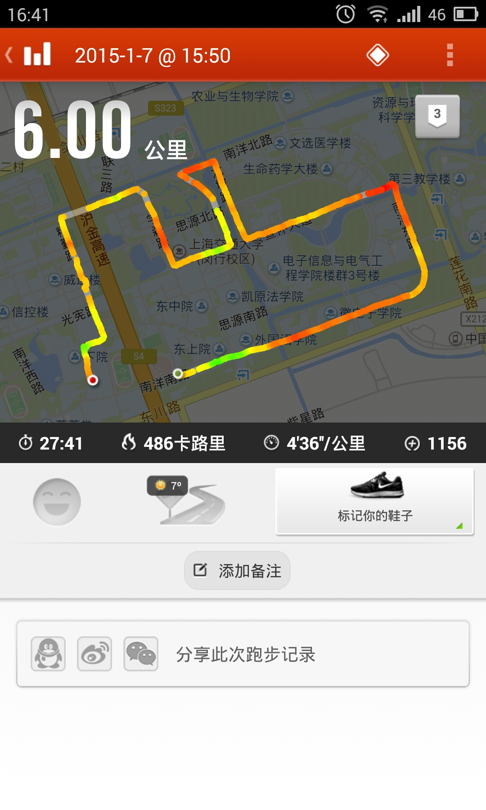
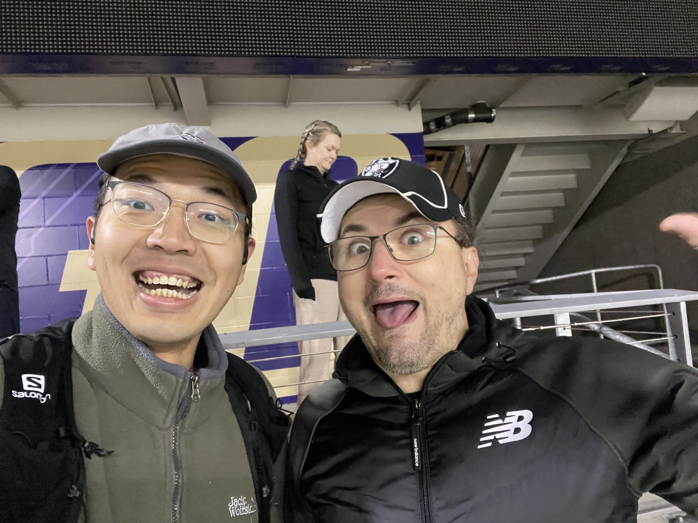
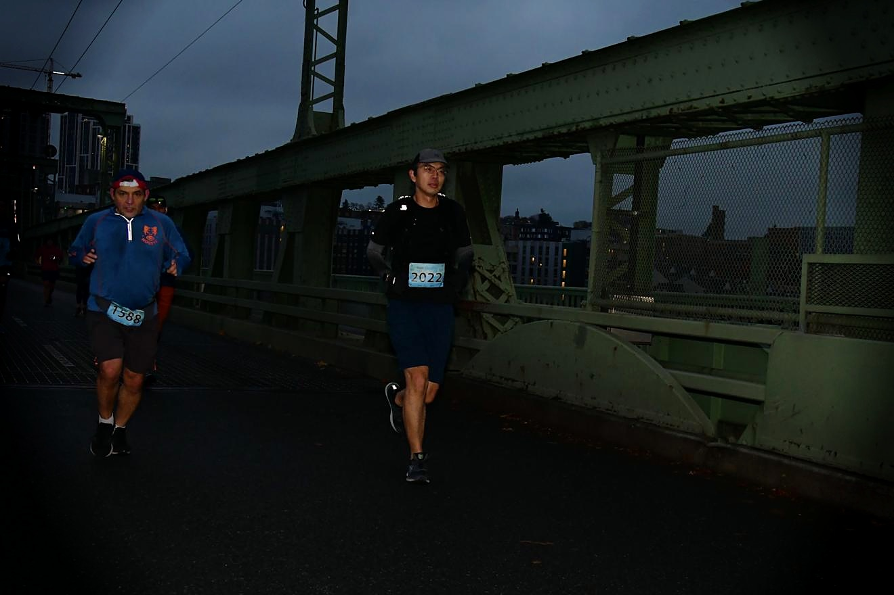
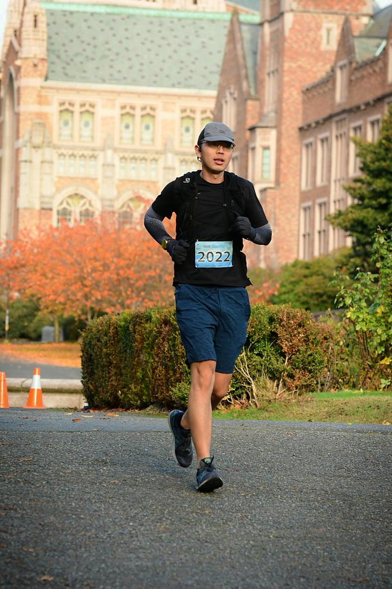
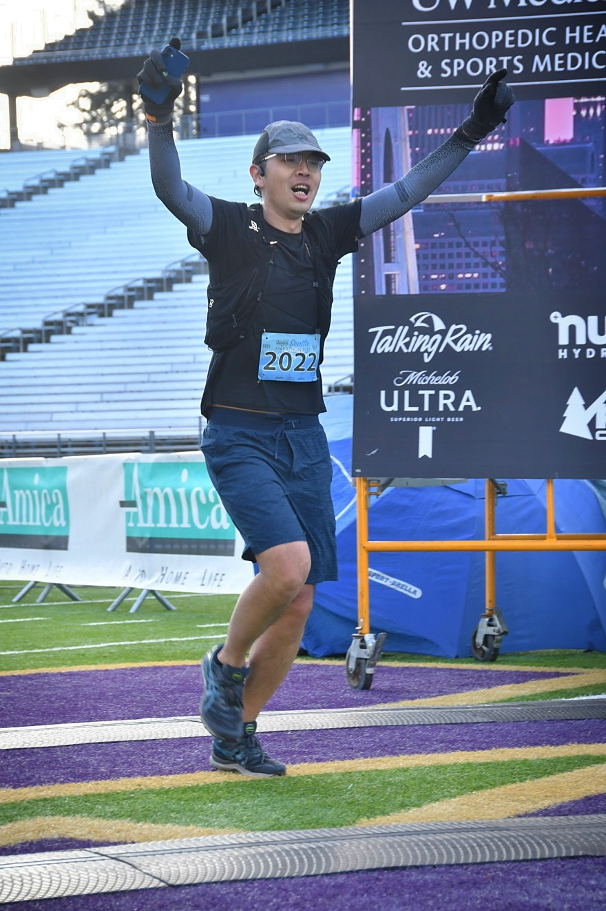

# 十年跑完的42.195公里

二零二二年年十一月二十六日，周六，520桥贝尔维尤往西雅图方向，我正跑着。

这是一个西雅图典型的阴天。强劲的侧风让我不断扶着帽子以防吹走，无暇欣赏两侧华盛顿湖的景色。我已经跑了三个多小时，刚过19英里（30公里），是一个在训练中从未跑到过的距离。乳酸的堆积让我的脚步变得沉重，心率也逐渐升高。望着远处的Husky Stadium突然有些恍惚，我怎么会在感恩节周末的早晨出现在这里。

故事可能要从十年前说起。

---

一般来说，我试图做一个说到做到的人。

差不多刚好十年前，我十八岁，刚上大学不久。记得有一次高中同学的聚会，有人带了摄像机，让大家对着镜头说出自己的梦想或对未来的期许。

我说，**我要跑马拉松**。

事实上当时我并没有跑步，梦想对于一个刚结束高考的懵懂年轻人更是从没想过的事。只是因为刚看了村上春树的《当我谈跑步时我谈些什么》，觉得跑马听起来很酷，便随口说了一句，说完也就忘了。一直到了大三的某天我突然想起这事来，加上需要放松学业的压力，才决定开始跑步。

那时没有计划也不懂配速，就只是跑着。三公里五公里七公里，每一次我都竭尽全力。从西区宿舍开始，跑到新图，庙门，电院草坪，凯旋门，微电子楼。平常骑车都觉得远的闵行校区在脚下似乎也没有那么大了。跑步给我带来了前所未有的快乐，这也是我大学最美好的回忆之一。

好景不长，寒假回家时，某次刚跑过3公里，左膝盖突然传来一阵刺痛。我本以为休息两天就好，结果之后每次跑都有相同的问题，难以坚持。去医院检查显示左膝半月板损伤，没有太好的治疗办法。虽然并不影响日常生活，但不建议过度锻炼。

我刚燃起的跑步热情被这盆冷水瞬间浇灭，感慨自己跑跑步怎么会受这种足以终结一个职业运动员生涯的伤病。虽然可惜但也只能先停跑，也不知道还能不能完成这个梦想。

---

来美国后也跑过几次步，但并不规律。得益于Pacific Northwest美丽的自然景观，我开始热衷于徒步。但每当挑战有些难度的路线，体力总是吃紧。今年夏天，我开始考虑要不要认真训练跑步以提高耐力。想想膝盖也很多年没有痛过了，说不定就好了呢？

重拾跑步的过程还算顺利。这次我学了很多相关知识，指定了周密的计划，买了专业的缓震跑鞋。单次跑步距离从五公里逐渐增加到十公里以上。虽然我的配速就如同头发，不再能与大学时相比，但至少身体没有出现过任何不适。这个时候我还没有想过，或者说不敢，把马拉松作为目标。

转折点是九月的柏林马拉松，我观看了全程。38岁的基普乔格如同天神下凡，再次大幅度打破了由他本人保持的世界纪录，又一次把人类的极限往前推了一步。我激动的跳了起来，决定第二天的长距离拼了，看看自己到底能跑多远。最后我从Gas Works Park出发，沿着团结湖跑到Salmon Bay，绕了一大圈，凑足了一个半马。

这是我人生的第一个半马，竟然并没有感觉太累，非常顺畅的就跑完了。回到家后的第一件事就是打开电脑注册西雅图马拉松，全程。

你们知道，我的故事永远一波三四五六折。

在十月初我参加了一个学校的10公里比赛。完赛自然不是问题，我预期自己至少能跑进50分。开赛前3天我跑了一个15K的渐进跑，跑完左大腿后侧有些异物感。因为症状不明显我也没想太多，只减少了接下来两天训练量。

10K比赛开跑没多久大腿的异物感再度出现，但人在比赛中是不会想这么多的，观众的加油声可以盖住一起。我仍保持配速。一直到了最后1 mile，异物感转变成了剧烈疼痛，完全没有办法继续。我一瘸一拐的走完了最后这段路，成绩是53分。我万分懊恼，不是因为受伤了，而是因为没有跑进50。

第二天伤势变严重了，整个左腿完全无法动弹。我判断是腘绳肌拉伤，而且不轻。或许我应该去医院，但尴尬的是我此时寸步难行。这点并不危及生命的伤病我也不好意思叫人帮我或者叫救护车。

在房间里我都是坐在椅子移动，还算方便。难点在于从房间去卫生间需要上两节台阶，此时真是要了我的命。我试了好几次也没能挪上去，到最后累的满头大汗，一屁股坐了下来。那天晚上我刚交完一个注定被拒的rebuttal，坐在台阶上突然就感到无比的委屈和无助，是我在圣海伦的晚上也没有过的感觉。

我知道这么快就跑全马非常不科学，但我实在是太需要一个疯狂的目标来给激励自己的生活了。这两年我过的不好，经历了无数次被拒，有时候一整天没有机会说一句话。

可是又有谁过去两年过得好呢？我何必这样矫情。遇到问题，解决问题。伤病本就是运动的一部分，马拉松跑到最后没有人是舒服的。在这样一个时代，对于很多人**自由奔跑**都成了奢望。我要好好养伤，珍惜能够每一个能够跑步的日子。

这次受伤持续了快三周才好，距离西雅图马拉松还有整一个月。我更加谨慎的安排恢复训练，小心的增大跑量。我认识到减重是保证无伤完赛最重要条件，便开始严格控制饮食。最后这个月瘦了十斤，终于以我五年来最轻的体重踏上了起跑线。

---

跑马拉松吸引人的地方除了运动本身，就是你会遇到形形色色的有趣跑者。

等待开赛的我非常紧张，非常担心自己坚持不下来或者再次受伤。这时旁边一个白人大叔和我打招呼，问我Where are you from，我说China，他又问China哪里。我想这就是美国人的随口一问，对你家乡表示礼貌性的好奇，就说Hunan，不太出名你可能没听说过。这个时候他突然用中文问我，湖南哪里？我一下愣住了。他开始和我讲他的故事，以下对话全是中文：

> 「我在中国学习工作了五年。我在两个大学读过书，但都是小地方不出名的学校。」
> 
> 「什么学校啊？」
> 
> 「你肯定没听说过，很一般的学校。」
> 
> 「没关系，可能我知道。」
> 
> 「一个是北京大学，一个是香港科技大学。」
> 
> 「。。。。」
> 
> 「你看你不说话了，是不是没听过。」
>

我大笑，这位叫克里斯的朋友虽然中文很好，幽默感还是和美国人一样的冷。他告诉我他做投资咨询工作，在中国时就各处旅游跑马，去过每一个省。疫情之后离开了中国，继续满世界飞，到现在已经跑了80场马拉松。刚从伊斯坦布尔回美国，跑完西雅图就要去圣安东尼奥和达拉斯跑。

克里斯充满激情，语速超快。他依靠奖学金拿了几个MBA学位，会说英语中文韩文越南语。他喜欢体育赛事，是国安球迷，CBA中超中甲甚至中乙都看，还吐槽我们中国人只知道看NBA（没错，我被一个美国人吐槽看NBA）。他身材不瘦，憨态可掬，但全马PB330。他在多家大公司工作，但穿着一双160人民币的361度，因为“耐克太贵”。。。

克里斯是一个神奇的人，他的故事足以再写一篇文章。认识克里斯是我这次跑马的一大惊喜。

    

---

开赛后看到的有趣跑者就更多了，有穿着袍子拿着法杖cos哈利波特的，有穿着粉红居家服的，有举着牌子为慈善机构募捐的。一个男生到赛道边拥吻给他加油的女朋友，然后继续干劲十足的往前冲。一切都令人兴奋又感动，马拉松不再是单纯的比赛，而更像是一个大party。

对我而言，严肃训练的确是为了参赛，但能坚持下来说到底还是因为跑步本身是件令人愉快的事。我开始放松下来，不再过多纠结配速和心率。我积极的和每一个志愿者和观众互动。道谢，加油，尖叫，挥手，尽情的享受此时此刻。不管这次能不能完赛，路都永远在这里，我会一直跑下去。

    

---

早就听说，真正的马拉松在30公里开始，我算是体会到了。

跑下520桥后我的体力逐渐耗尽，双脚的沉重感也传遍全身。手里拿的能量胶，头上戴的帽子都仿佛有千斤重，速度难以控制的往下掉。脚底，脚背，髂胫束，双腿的每一个地方都开赛轮流疼痛。我开始更加频繁的看表，每0.1英里都显得无比漫长。

此时达到预期的五小时完赛目标已不是问题，但我丝毫没有开心的感觉。前期的兴奋已在四个小时的不停奔跑中消耗殆尽。我在心中咒骂西雅图马拉松的坑爹路线，跑完大坡跑泥地，不知道是城市马拉松还是越野跑。接着又咒骂自己，为什么要来受这个苦啊，只想着之后再也不要跑马了。

这种心情一直持续到进入UW校园。我跑过了EEB，绕过了喷泉，一个个熟悉又久违了的地方。此时已经跑过了25英里（40公里），只有最后的了两公里多了。我挤出最后的力气，向终点冲去。

    

---

当我冲进Husky Stadium的时候，一切紧张，担忧，疲惫，酸痛全都抛到了脑后。这个故事也到达了高潮：

在一个这样的日子，一座这样的城市，我参加一场这样的比赛，遇到一群这样的人，跑过一个这样的校园，冲进一个这样的体育场。

这不再是简单的跑完42公里，我完成十年前对自己许下的诺言。我在2022年，作为2022号选手，经历了人生最快乐的时光之一。

这大概就是马拉松最大的魅力。它是一个有风险，有难度的极限运动。但同时几乎所有身体健康的人，在经过系统刻苦的训练后都能够完成。

**这是一项与过去的自己而不是他人比赛的运动。**

当你看到冲过终点线的男女老少高矮胖瘦，戴上属于自己的奖牌。想到这些不同人群，可能都和你一样：天没亮起床，冒着风雨训练，戒酒，戒糖，经历各种伤痛，做到一切你以为不可能做到的事。你会有一种由衷的归属感和成就感。

所以为什么要跑步呢？

因为我想要**活的不普通**。

> 世上时时有人嘲笑每日坚持跑步的人：“难道就那么盼望长命百岁？”我却以为，因为希冀长命百岁而跑步的人，大概不太多。怀着“不能长命百岁不打紧，至少想在有生之年过得完美”这种心情跑步的人，只怕多得多。同样是十年，与其稀里糊涂地活过，目的明确、生气勃勃地活当然令人远为满意。跑步无疑大有魅力：在个人的局限性中，可以让自己有效地燃烧——哪怕是一丁点儿，这便是跑步一事的本质。
> 
> —— 村上春树

    

